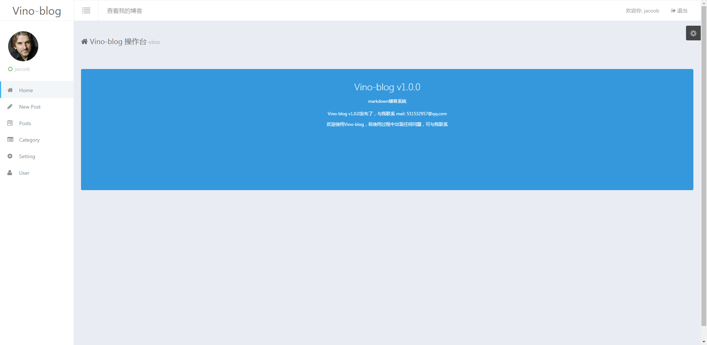
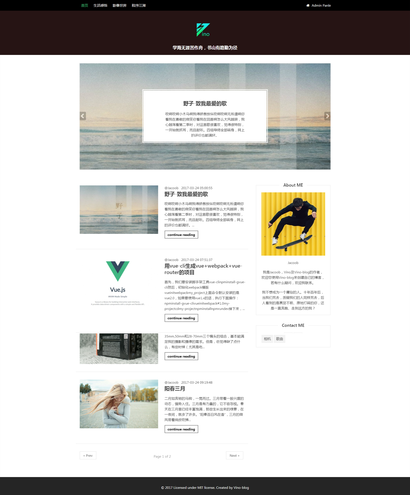

# Vino-blog一款用PHP开发的markdown博客系统

欢迎使用Vino-blog创建你的个人博客，它是一款支持markdown的博客引擎。

## 特性

1.php+mysql动态站点，集成前后台，快速安装，快速拥有一个博客

2.支持markdown发布文章，排版方便，减少像Wordpress那样大量p标签造成空行不一致的痛苦

3.快速高效，经个人压测结果，比Wordpress至少快3-5倍

4.后台界面清新美观，前台主题可自由开发，使用twig模版引擎

5.使用vino框架底层驱动，是一款轻量级框架

6.容易二次开发，只要懂html+css及简单学习twig即可定制博客模版

7.持续迭代+国人开发

## 安装

"需要 php 版本大于等于 php5.5"

1.下载该git库

2.导入数据库，可使用phpmyadmin导入，也可使用命令 

```shell
# cd vino_blog 先进入下载目录执行下面命令 
mysql -u用户名 -p密码 < vino-blog.sql
```

windows下可进入mysql终端执行source命令

```mysql
source vino-blog.sql
```

3.若是linux：

```shell
# 安装依赖库
php vino-cli install
# run 一个server
php vino-cli server
```

若是windows

​    1⃣️.安装composer 参考 http://docs.phpcomposer.com/00-intro.html#Installation-Windows

​    2⃣️.通过composer安装依赖，执行命令

```shell
# composer全局安装
composer install
# composer局部安装
php composer.phar install
```

​    3⃣️.执行命令 

```shell
php -S localhost:8081   #端口号任意
```


### 使用Vino-blog可以方便快速的创建个性化博客站点！！！

下面是Vino-blog的后台界面一个截图，




再看看它的首页




> 有兴趣可以访问这个站点：http://vinoblog.tech

另外可以直接下载本项目到本地体验，若有不懂，欢迎提issues～～～