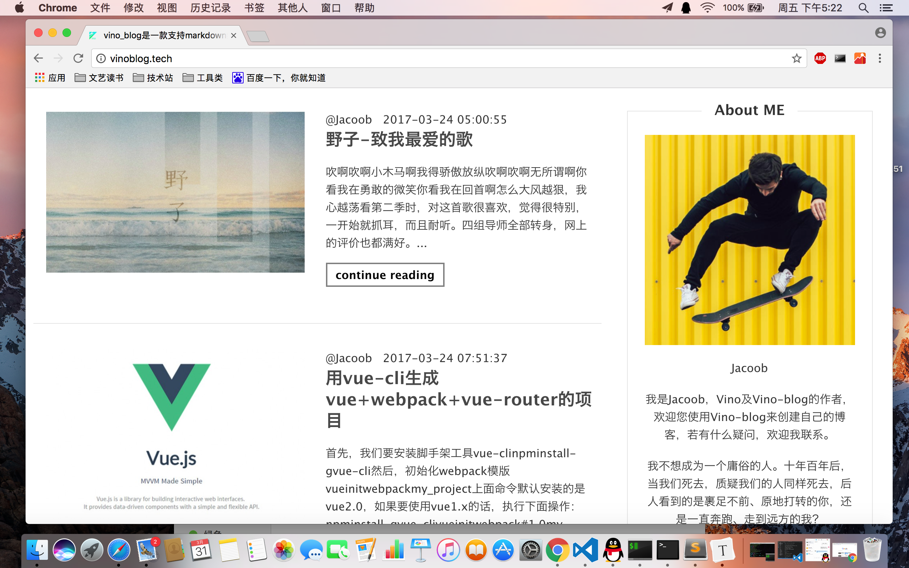
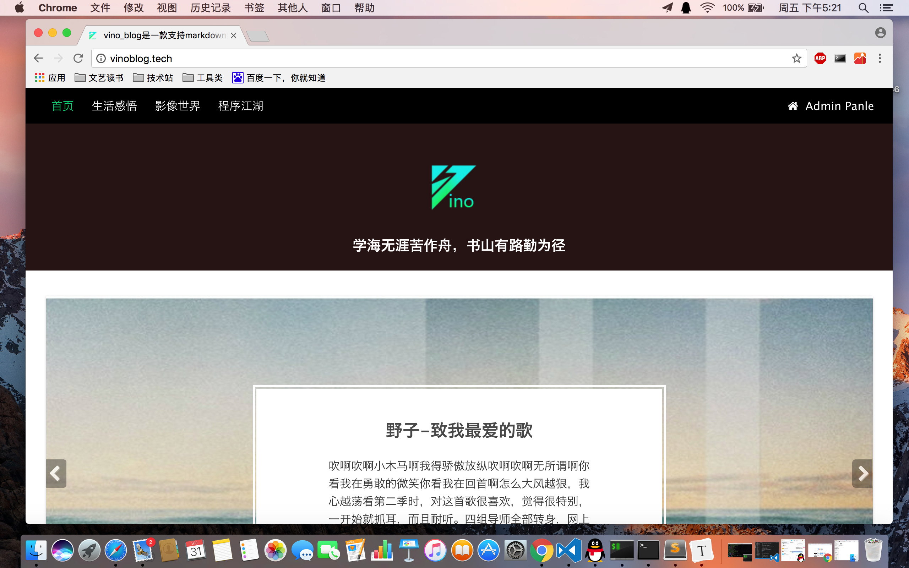
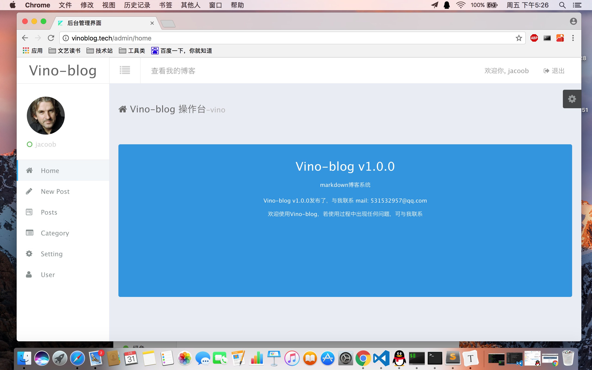
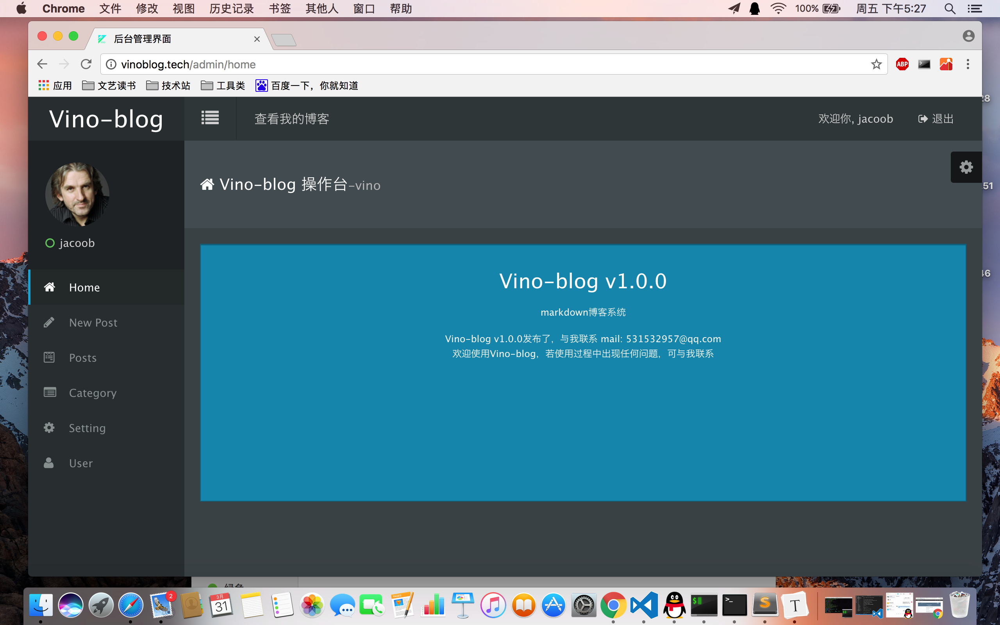

# Vino-blog一款用PHP开发的markdown博客系统


<p align="center"><a href="http://vino-blog.tech"></a></p>

<p align="center">🎈 Vino-blog  是一款开源的博客引擎，它使用vino(php框架)和amaze ui构建. <a href="http://vinoblog.tech">http://vinoblog.tech</a>

## 特性

- php+mysql动态站点，集成前后台，快速安装，快速拥有一个博客
- 支持markdown发布文章，减少Wordpress排版的痛苦
- 高性能，经压测显示，比Wordpress至少快3-5倍
- 前台主题可自由开发，使用twig模版引擎，易二次开发
- 使用vino框架底层驱动，vino是一款轻量级框架
- 文章和分类管理及标签管理
- 首页轮播图和个人信息配置
- 后台支持两个色系的UI，可自由切换

## 预览









## 安装

> 需要 php 版本大于等于 php5.5.9

#### 1.下载该git库或者通过composer安装

git 方式

```shell
git clone https://github.com/jacoobwang/Vino-blog.git
```

composer 方式，需要先安装composer

```shell
composer create-project jacoob/vino-blog
```

#### 2.导入数据库，可使用phpmyadmin导入，也可使用命令

Linux下 

```shell
# cd vino_blog 先进入下载目录执行下面命令 
mysql -u用户名 -p密码 < vino-blog.sql
```

windows下

```mysql
进入mysql terminal执行
source vino-blog.sql
```

#### 3.启动php server

linux下

```shell
php vino-cli server
```

windows下

```shell
项目目录下执行
php -S localhost:8081   #端口号任意
```

## Thanks

- [Amazeui](http://amazeui.org)
- [Vino](https://jacoobwang.github.io/vino/vino.html)

## License

The project is open-sourced software licensed under the [MIT license](http://opensource.org/licenses/MIT).