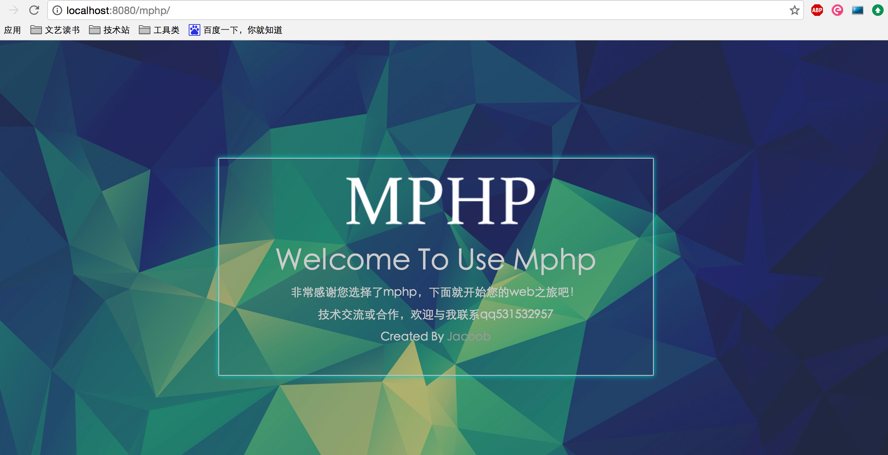

# Mphp Framework

Mphp is a PHP framework that helps you quick build web applications and APIs.

## Installation

1,Now you can download from this github respository,use git clone https://github.com/jacoobwang/Mphp.git or click button download zip.ether is ok.

2,When you finished download,you should use composer install some php packages that you can find it in the file ---- composer.json.

Use this cmd:

```php
php composer.phar install 
```

3,When you installed packages,if you web container is nginx ,you sholud modify nginx.conf.

```json
location /mphp/ {
	try_files $uri $uri/ /mphp/index.php?_url=$1&$args;
}
```

If you use apache ,just open rewrite module is ok.Mphp user .htaccess file.

4,At last, you should open your browser visit http://localhost/mphp/ 

you will see :



So ,congratulations，it's worked!

and i also support examples like login and reg function in the UserCrontoller.

you can visit http://localhost/login to find it.

## Documentation

You can visit this website to learn more

http://www.loadphp.cn/mphp/index.html

## Ends

If you have some ideas,welcome contact me ! 

Thank you very much!